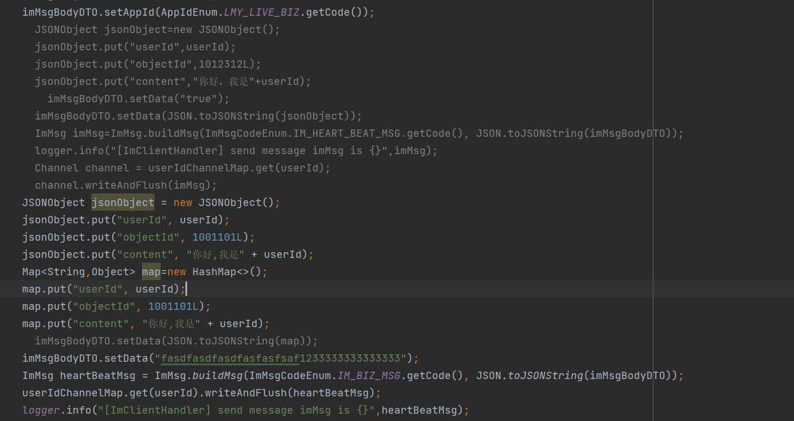

# lmy-live-app
SpringCloudAlibaba高并发仿斗鱼直播平台实战

# 7-18 基于RocketMQ实现IM系统和业务服务的沟通
## Issue1 
### 2024年7月9日22:30:08
imclient.ImClientHandler
this file ,  用于测试发送biz消息给core server， core server来处理消息，发送给rockmq，msgProvider 进行消费。
但是发送的消息只能是下面这样， data属性，如果发送是对象的string， 那么只有第一次发送，core server才能收到，之后就没有反应。目前不知道怎么回事，

*** 
## issue2