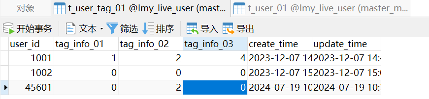

# lmy-live-app
SpringCloudAlibaba高并发仿斗鱼直播平台实战

# 7-18 基于RocketMQ实现IM系统和业务服务的沟通
## Issue1 
### 2024年7月9日22:30:08
imclient.ImClientHandler
this file ,  用于测试发送biz消息给core server， core server来处理消息，发送给rockmq，msgProvider 进行消费。
但是发送的消息只能是下面这样， data属性，如果发送是对象的string， 那么只有第一次发送，core server才能收到，之后就没有反应。目前不知道怎么回事，

问题原因：
发送中文时， body.getLength() 是字符串数组的长度， 这个长度跟netty 读取的byte不匹配
1.可以参考下面的帖子
https://cloud.tencent.com/developer/article/1650086
2. body.getByte("UTF-8").length
*** 
## issue2

## 启动MS的顺序
7-25 节: ImProviderApplication=> ImCoreServerApplication=>
ImRouterProviderApplication=>MsgProviderApplication=>ImClientApplication1

08-02节:
启动顺序

头像设置：
需要找到手机号对应的user， 找到对应的表， 手动把图片地址加上
到对应的user_tag表， 加上吧tag_info02 改成2
